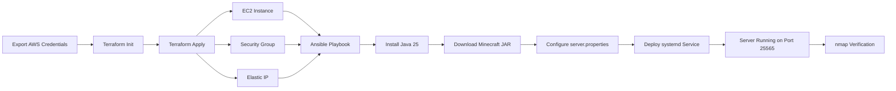

# Minecraft Server — Course Project Part 2

Automated provisioning and configuration of a Minecraft Java Edition server on AWS EC2, using Terraform and Ansible. The full deployment pipeline runs from a single script with no manual interaction with the AWS Management Console.

---

## Background

### What Are We Doing?

This repository contains the Infrastructure as Code (IaC) scripts to deploy a Minecraft Java Edition server on an AWS EC2 instance. The server is configured to start automatically on boot and shut down gracefully when the instance is stopped.

### How Are We Doing It?

The pipeline is split into two stages:

1. **Provisioning** (Terraform): Creates all required AWS resources — an EC2 instance, security group, SSH key pair, and Elastic IP address.
2. **Configuration** (Ansible): Connects to the provisioned instance over SSH and installs all dependencies, downloads the Minecraft server JAR, configures the server, and registers it as a `systemd` service.

A single shell script (`scripts/deploy.sh`) orchestrates both stages in order. Once complete, the Minecraft server is reachable at the instance's public IP on port `25565`.

> **Note:** This project is a follow-up to a manual deployment. A key improvement over the previous setup is the addition of a proper graceful shutdown mechanism via `KillSignal=SIGINT` in the `systemd` service unit, which ensures the Minecraft world is saved correctly before the process exits.

---

## Requirements

### Tools

Ensure the following tools are installed on your local machine before running the pipeline:

| Tool | Version | Install |
|------|---------|---------|
| [Terraform](https://developer.hashicorp.com/terraform/install) | >= 1.5 | `brew install terraform` |
| [Ansible](https://docs.ansible.com/ansible/latest/installation_guide/) | >= 2.15 | `pip install ansible` |
| [AWS CLI](https://aws.amazon.com/cli/) | >= 2.0 | `brew install awscli` |
| [nmap](https://nmap.org/download.html) | >= 7.9 | `brew install nmap` |

On Windows, use [winget](https://learn.microsoft.com/en-us/windows/package-manager/winget/) where `brew` is shown, or refer to each tool's installation page linked above.

Verify all tools are installed and available on your `PATH`:

```bash
terraform --version
ansible --version
aws --version
nmap --version
```

### SSH Key Pair

Ansible connects to the EC2 instance using your local SSH key. If you do not already have one, generate it now:

```bash
ssh-keygen -t rsa -b 4096 -f ~/.ssh/id_rsa
```

The public key at `~/.ssh/id_rsa.pub` will be uploaded to AWS as part of the Terraform provisioning step.

### AWS Credentials

This project is designed for use with an **AWS Academy Learner Lab**. Retrieve your credentials from the Learner Lab dashboard and export them as environment variables in your terminal before running anything:

```bash
export AWS_ACCESS_KEY_ID=<your-access-key-id>
export AWS_SECRET_ACCESS_KEY=<your-secret-access-key>
export AWS_SESSION_TOKEN=<your-session-token>
export AWS_DEFAULT_REGION=us-east-1
```

> AWS Academy credentials are temporary and expire when your lab session ends. Re-export them at the start of each new session.

### Terraform Variables

Copy the example variables file and fill in your values:

```bash
cp terraform/terraform.tfvars.example terraform/terraform.tfvars
```

Then edit `terraform/terraform.tfvars`:

```hcl
aws_region        = "us-east-1"
instance_type     = "t2.medium"
public_key_path   = "~/.ssh/id_rsa.pub"
minecraft_jar_url = "https://piston-data.mojang.com/v1/objects/<hash>/server.jar"
```

The `minecraft_jar_url` value must be the direct download URL for the latest `server.jar`, available on the official [Minecraft Server download page](https://www.minecraft.net/en-us/download/server). Right-click the download link and copy the URL.

> `terraform.tfvars` is listed in `.gitignore` and will not be committed to the repository.

---

## Pipeline Diagram



---

## Running the Pipeline

### 1. Clone the Repository

```bash
git clone https://github.com/russelm3/sysadmin_project2.git
cd sysadmin_project2
```

### 2. Configure Credentials and Variables

Export your AWS credentials and fill in `terraform/terraform.tfvars` as described in the [Requirements](#requirements) section above.

### 3. Run the Deploy Script

```bash
chmod +x scripts/deploy.sh
./scripts/deploy.sh
```

The script will:

1. Run `terraform init` to download the AWS provider plugin
2. Run `terraform apply` to provision the EC2 instance, security group, key pair, and Elastic IP
3. Extract the public IP from Terraform's output and generate an Ansible inventory file
4. Wait for the instance SSH service to become available
5. Run the Ansible playbook to install Java, download the Minecraft server, and configure the `systemd` service
6. Run `nmap` to verify the server is reachable on port `25565`

### 4. Run Stages Individually (Optional)

If you prefer to run each stage separately for debugging purposes:

**Terraform only:**

```bash
cd terraform
terraform init
terraform apply -auto-approve
```

**Ansible only** (after Terraform has run and you have a public IP):

```bash
cd ansible
ansible-playbook -i inventory.ini playbook.yml
```

**Verify only:**

```bash
nmap -sV -Pn -p T:25565 <public-ip>
```

### 5. Tear Down

To destroy all provisioned AWS resources when you are done:

```bash
cd terraform
terraform destroy -auto-approve
```

---

## Verifying the Deployment

At the end of `deploy.sh`, `nmap` is run automatically. A successful deployment will produce output similar to the following:

```
Starting Nmap 7.94 ( https://nmap.org )
Nmap scan report for ec2-<ip>.compute-1.amazonaws.com (<public-ip>)
Host is up.
PORT      STATE SERVICE   VERSION
25565/tcp open  minecraft Minecraft 1.21.x
```

The port state must read `open`. If it reads `filtered` or `closed`, verify:

- The security group inbound rule for TCP port `25565` is correctly applied
- The `minecraft` service is running on the instance: `sudo systemctl status minecraft`
- The `server-port=25565` value is set correctly in `server.properties`

### Verifying Auto-Start After Reboot

To confirm the server restarts automatically on instance reboot, use the AWS CLI to reboot the instance without connecting to the console:

```bash
# Retrieve the instance ID
INSTANCE_ID=$(aws ec2 describe-instances \
  --filters "Name=tag:Name,Values=minecraft-server" \
  --query "Reservations[0].Instances[0].InstanceId" \
  --output text)

# Reboot the instance
aws ec2 reboot-instances --instance-ids $INSTANCE_ID
```

Wait approximately 90 seconds, then re-run the `nmap` command. If port `25565` is open, the `systemd` service has restarted the Minecraft server automatically.

---

## Connecting to the Minecraft Server

Once the pipeline has completed successfully, the server is accessible at:

```
<public-ip>:25565
```

The public IP is printed at the end of `deploy.sh`. You can also retrieve it at any time with:

```bash
cd terraform && terraform output public_ip
```

Because the instance is assigned an **Elastic IP**, the public address remains the same across instance reboots for the lifetime of the deployment.

To connect using the Minecraft Java Edition client, add the public IP as a new server in the multiplayer menu. No port number needs to be appended, as `25565` is the default Minecraft port.

To verify connectivity without a Minecraft client:

```bash
nmap -sV -Pn -p T:25565 <public-ip>
```

---

## Repository Structure

```
sysadmin_project2/
├── README.md                        # This file
├── terraform/
│   ├── main.tf                      # AWS resource definitions
│   ├── variables.tf                 # Input variable declarations
│   ├── outputs.tf                   # Output values (e.g., public IP)
│   └── terraform.tfvars.example     # Template for required variables
├── ansible/
│   ├── playbook.yml                 # Top-level Ansible playbook
│   └── roles/
│       └── minecraft/
│           ├── tasks/
│           │   └── main.yml         # Installation and configuration tasks
│           ├── templates/
│           │   └── server.properties.j2  # Minecraft server config template
│           └── files/
│               └── minecraft.service     # systemd unit file
└── scripts/
    └── deploy.sh                    # Orchestration script (runs Terraform then Ansible)
```

---

## Design Notes

### Why Terraform + Ansible?

Terraform is purpose-built for provisioning cloud infrastructure declaratively. Ansible complements it by handling the configuration layer — installing software, managing files, and controlling services — without requiring an agent on the remote host. Together they cover the full lifecycle from an empty AWS account to a running game server.

### Graceful Shutdown

The previous manual deployment used the default `systemd` stop behavior, which sends `SIGTERM` to the process. Minecraft does not handle `SIGTERM` gracefully and exits without saving the world state. This deployment fixes that by configuring:

```ini
KillSignal=SIGINT
```

`SIGINT` is equivalent to pressing `Ctrl+C` in an interactive terminal, which Minecraft interprets as a clean shutdown signal, triggering a world save before exit.

### Elastic IP

Without an Elastic IP, the EC2 instance receives a new public IP address each time it starts. An Elastic IP allocates a static address that persists for the lifetime of the deployment, making the server address stable and predictable.

---

## Resources

- [Terraform AWS Provider Documentation](https://registry.terraform.io/providers/hashicorp/aws/latest/docs)
- [Ansible Documentation](https://docs.ansible.com/)
- [Minecraft Server Download](https://www.minecraft.net/en-us/download/server)
- [Minecraft server.properties Reference](https://minecraft.wiki/w/Server.properties)
- [systemd Service Unit Documentation](https://www.freedesktop.org/software/systemd/man/systemd.service.html)
- [AWS EC2 Documentation](https://docs.aws.amazon.com/ec2/)
- [Adoptium Temurin (Java 25)](https://adoptium.net/)
- [nmap Reference Guide](https://nmap.org/book/man.html)
- [AWS Blog: Setting up a Minecraft Java server on Amazon EC2](https://aws.amazon.com/blogs/gametech/setting-up-a-minecraft-java-server-on-amazon-ec2/)
